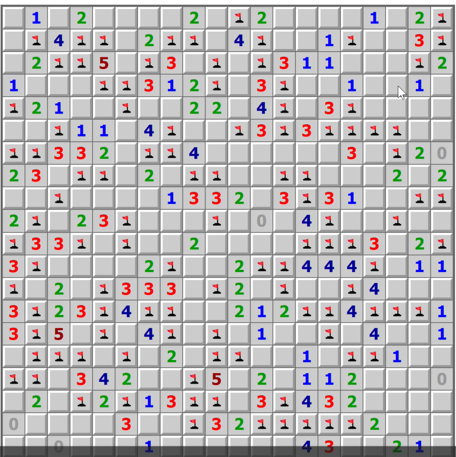

# MineSweeper 💣

A robot to Solve minesweeper in a certain website.

## Introduction

This is a personal project to solve a [minesweeper website](https://www.puzzle-minesweeper.com) using `Python`. The puzzle is a solvable minesweeper. Where `number clues` are scattered across the puzzle from the start, AND there is zero requirement to guess or use probability. `ONLY DEDUCTION` is required.

I spent 7 - 10 mins daily clearing the `daily-minesweeper` difficulty which is a HUGE map. But as going through [boot.dev](boot.dev), there is a lesson to create a personal project. Might as well spent 20 - 40 hrs on it so that I save 7 - 8 mins daily.

## Environment and Requirement.

This project is using [uv](https://docs.astral.sh/uv/) for the following
- package management
- virtual environment management
- formatter (uv's ruff)
- linter (uv's ruff)

Please follow the installation guide on [uv](https://docs.astral.sh/uv/). Below command shows the current `uv` version
```bash
$ uv --version
uv 0.7.6
```

**ALSO**, To retrieve data and submit clicks into the website, this project uses Selenium and Firefox browser. So you will need to download the [necessary browser and driver](https://www.selenium.dev/documentation/webdriver/browsers/firefox/). 

### Running the project

Clone the project
```bash
$ git clone ...daily-minesweeper-solver.git
$ cd daily-minesweeper-solver.git
```

Run the project
```bash
# if there are no difficulty, it defaults to daily minesweeper 
$ uv run python src/main.py
```

```bash
# this runs a 5x5 easy minesweeper
$ uv run python src/main.py easy_5
```

## Walkthrough

A brief description of how the puzzle is solved.

1. `selenium` to access the URL of selected difficulty.
2. `parser` to parse the html into a 2D `list[list[str]]`.
3. Initialize the `Board` with 2D array into respective `Cell`.
4. For each strategy, run through `logical_strategy` for each cell.
    - each strategy works on a single cell.
    - restarts the loop if a strategy works and there is a change in `Board`
5. Once there are no changes, ends the loop.
6. Identify the coordinates of all clickable cells and flagged cells.
7. `selenium` to find all clickable cells in html elements.
8. Click each element if it has the same coordinate as flagged cells.
    - if the clickable element is outside of viewport, scroll the element into view.


## Demo

#### Console view


#### Website clicks



#### Gif capture

